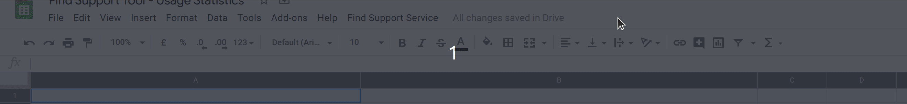

# Export checkbox data

Aggregated anonymous daily data can be extracted from the application for any
specified time period using the `/data-export-checkbox` route.  Output is available in
CSV format.

For example, to get data for a seven day period starting 10th April 2020:

     <path-to-service>/data-export-checkbox.csv?start_date=2020-04-08&end_date=2020-04-15

If dates are not supplied, it will output a CSV covering all times in the DB:

     <path-to-service>/data-export-checkbox.csv

## Google App scripts & Sheets

Performance Analysts have access to the aggregate data through a Google sheet which can be found here:
[Find Support Tool - Checkbox Analytics Data](https://docs.google.com/spreadsheets/d/1R5e5KvPSXHRowLL65rXSSBMn5eOT6R8ayh2xyZYjsKU/edit?usp=sharing)

The sheet uses a fetch script written with Google App scripts ([see script here](https://script.google.com/a/digital.cabinet-office.gov.uk/d/1y3lcZRJFNbr4s-BkcWqgpG27jCs4hE60wCeD_2qpeYEoEXd4iNktC7e1/edit?mid=ACjPJvFLK0nsl8pqiwvhxYDwlc_OJtOdVrP138GmcG4SHclssMtTdV8wQQoxSx31eNikpS2Abo9LyCx8cqAehcUWzuQV93KtN4rTAWTd2M-MPEST81Vjc4UqsU9RVzZUX1pWnyjswEPSwxw&uiv=2)).

Updates are triggered once every day between midnight and 1am. They can also be triggered manually via the button in the UI

  
