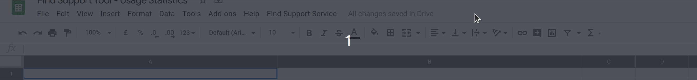

# How can you export data

Aggregated anonymous daily data can be extracted from the application for any
specified time period using the `/data-export` route.  Output is available in
CSV format.

For example, to get data for a seven day period starting 10th April 2020:

     <path-to-service>/data-export.csv?start_date=2020-04-08&end_date=2020-04-15

If a date is not supplied it will output a CSV covering all 1st Jan (i.e. before the app was built)
until tomorrow (effectively covering all times that should logically be in the DB):

     <path-to-service>/data-export.csv

## Google App scripts & Sheets

Performance Analysts have access to the aggregate data through a Google sheet which can be found here:
[Find Support Tool - Usage Statistics](https://docs.google.com/spreadsheets/d/1d0tqlBH83TkQ8oLGDSpbIDs0YWe2burhXA-m7OR3Irk)

The sheet uses a fetch script written with Google App scripts ([see dashboard here](https://script.google.com/home/projects/120es-7Lec6yZo9VdHMigppso2eaIeh1Nq39XevJj6LTp5Vo8ySGCF59P)).

Updates are triggered once every day between midnight and 1am. They can also be triggered manually via the button in the UI

  
